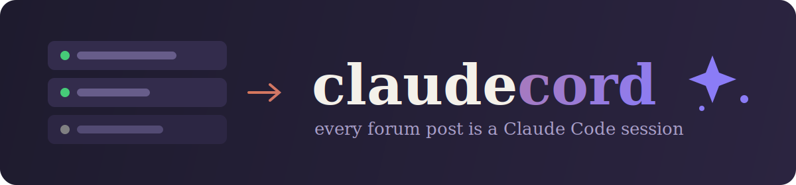

<div align="center">



<br/>

[](LICENSE)
[](https://bun.sh)
[](tsconfig.json)
[](https://discord.js.org)
[](https://code.claude.com/docs/en/agent-sdk)

**Turn a Discord forum channel into your Claude Code interface.**<br/>
New post → new session. Claude works right in the post — thinking, tool calls, and answers streamed live.

[Features](#features) · [Quick start](#quick-start) · [Usage](#usage) · [Commands](#commands) · [Configuration](#configuration) · [How it works](#how-it-works) · [Troubleshooting](#troubleshooting)

</div>

---

## Features

- 🧵 **Forum-native sessions** — Discord's *New Post* button is the whole UX. The post
  title names the session, your first message is the first prompt, and the post keeps
  full conversation context for as long as it lives.
- 💭 **Live activity stream** — Claude's thinking summaries and every tool call
  (`⏺ Bash · npm test`, `⏺ Edit · auth.ts`) appear in the post as a quoted feed that
  updates in place while it works.
- 🤔→✅ **Reaction acks, zero clutter** — your message gets 🤔 while Claude works and
  ✅ when the turn lands (❌ on failure). No "message received" spam.
- 🏷️ **Session tags** — posts carry 🟢 Active / ✅ Done forum tags, so the channel
  doubles as a session dashboard.
- ♻️ **Revival** — posting in an ended or archived session brings it back with its
  memory intact (sessions resume by SDK session id).
- 🖼️ **Images** — attach screenshots or photos to any message; they're passed to
  Claude inline.
- 🪶 **One process** — discord.js + the Claude Agent SDK. No tmux, no HTTP relay,
  no shell hooks, nothing to babysit.

## Quick start

### 1. Create the Discord bot

1. Go to the [Discord Developer Portal](https://discord.com/developers/applications) → **New Application**.
2. Under **Bot**, enable the **Message Content Intent** (required — the bot reads your posts).
3. Under **OAuth2**, copy your **Client ID**, then invite the bot with this URL
   (it pre-selects the exact permissions claudecord needs):

```
https://discord.com/oauth2/authorize?client_id=YOUR_CLIENT_ID&scope=bot%20applications.commands&permissions=292057860176
```

<details>
<summary>What those permissions are</summary>

Manage Channels (creates the forum during <code>/setup</code>), Manage Threads (tags &
archives posts), Send Messages, Send Messages in Threads, Add Reactions, Embed Links,
Read Message History.

</details>

### 2. Install and run

Requires [**Bun**](https://bun.sh) (`curl -fsSL https://bun.sh/install | bash`) and a
machine where the [Claude Code](https://claude.com/claude-code) CLI is logged in —
claudecord rides your existing Claude subscription. (Alternatively, set
`ANTHROPIC_API_KEY`.)

```bash
git clone https://github.com/christianfurr/claudecord.git
cd claudecord
bun install
bun link             # puts the `claudecord` command on your PATH

# Put your bot token in a .env file (Bun loads it automatically):
echo "DISCORD_TOKEN=your-bot-token" > .env

claudecord install   # installs + starts the macOS daemon (launchd)
claudecord status
```

Prefer to run it in the foreground instead of as a daemon? `bun start` (or
`bun dev` for auto-restart on changes).

### The `claudecord` CLI

| Command | What it does |
|---|---|
| `claudecord install` | Write the LaunchAgent (token embedded, `0600`) and start it — runs at login, auto-restarts on crash |
| `claudecord status` | Daemon state + pid, session counts, recent log |
| `claudecord start` / `stop` / `restart` | Control the daemon |
| `claudecord logs` | Tail the logs (`~/.claudecord/logs/`) |
| `claudecord run` | Run in the foreground (no daemon) |
| `claudecord uninstall` | Remove the daemon (repo and config untouched) |

### Menu bar (optional)

A [SwiftBar](https://swiftbar.app)/xbar plugin ships in `extras/`: a 🤖 in your menu
bar (with the active-session count), green/red status, and Start/Stop/Restart/logs
one click away.

```bash
brew install swiftbar   # or xbar
ln -s "$(pwd)/extras/claudecord.5s.sh" "$HOME/Library/Application Support/SwiftBar/Plugins/"
```

You should see:

```
claudecord ready as your-bot#1234
registered 5 slash commands in 1 guild(s)
```

### 3. Set up the forum

In your server, run **`/setup`**. That creates a **#claude-sessions** forum channel
with 🟢 Active / ✅ Done tags and wires the bot to it. Done.

## Usage

**Start a session:** open **#claude-sessions** → **New Post** → title it
("fix the login bug", "research SaaS pricing") → describe what you want.

```
📋 #claude-sessions
 ├─ 🟢 fix the login bug           ← Claude is working in here
 ├─ 🟢 research SaaS pricing
 └─ ✅ set up CI                   ← done & archived
```

Inside a post you'll see something like:

> ⏺ **Grep** · loginHandler<br/>
> 💭 The token check happens before the session refresh — that ordering is the bug…<br/>
> ⏺ **Read** · auth.ts<br/>
> ⏺ **Edit** · auth.ts<br/>
> ⏺ **Bash** · run the auth test suite

…followed by Claude's actual reply as normal messages. Keep talking in the post —
it remembers everything. Sessions survive bot restarts and can be picked up days later.

## Commands

| Command | Where | What it does |
|---|---|---|
| `/setup` | anywhere | One-time: creates the forum + tags and saves the config |
| `/new prompt: [title:]` | anywhere | Start a session without leaving the keyboard — creates the titled post and sends the prompt |
| `/status` | anywhere | Every session with live/working/dormant state, uptime, model |
| `/open` | in a post | Pop the session open in Terminal on the host Mac (`claude --resume`) |
| `/clear` | in a post | Wipe the session's memory — fresh start, same post |
| `/end` | in a post | End the session, tag it ✅ Done, archive the post |
| `/rename title:` | in a post | Rename the post (and the session) |

## Configuration

Settings live in `~/.claudecord/config.json` (created by `/setup`):

```jsonc
{
  "forumChannelId": "…",        // set by /setup
  "tagActiveId": "…",           // set by /setup
  "tagDoneId": "…",             // set by /setup
  "workDir": "/Users/you/Code", // directory Claude sessions operate in
  "model": "claude-opus-4-8",   // optional — omit to use your Claude Code default
  "terminal": "Ghostty"         // app /open uses ("Ghostty", "Terminal", …)
}
```

The session registry (session numbers, SDK session ids, status) is in
`~/.claudecord/sessions.json`.

> [!WARNING]
> Sessions run with **permissions bypassed** — the SDK equivalent of
> `claude --dangerously-skip-permissions`. Claude can read, write, and execute
> anything your user account can, steered by whoever can post in the forum.
> Run this only in a private server where every member is someone you'd hand
> your laptop to.

## How it works

```
┌──────────────┐     forum post/message      ┌──────────────────┐
│   Discord    │ ──────────────────────────► │    claudecord    │
│ #claude-     │                             │  (one Node proc) │
│  sessions    │ ◄────────────────────────── │                  │
└──────────────┘   text, 💭/⏺ feed, embeds   └────────┬─────────┘
                                                      │ streaming input
                                                      ▼
                                             ┌──────────────────┐
                                             │  Agent SDK query │
                                             │  (per post, in   │
                                             │   your workDir)  │
                                             └──────────────────┘
```

Each post owns a long-lived Agent SDK query in streaming-input mode. Discord messages
are pushed into it; every SDK event streams back out — thinking blocks and tool calls
into the activity feed, text blocks as messages, the per-turn result as the reaction
ack. The registry maps thread ↔ session so restarts and revivals resume seamlessly.

## Troubleshooting

| Symptom | Likely cause |
|---|---|
| Bot online but ignores posts | Forum not configured — run `/setup`, then post in the forum it created |
| `DISCORD_TOKEN is not set` | Create the `.env` file next to `package.json` |
| Turn ends with ❌ and an auth error | Claude Code isn't logged in on this machine (`claude` in a terminal to check) — or set `ANTHROPIC_API_KEY` |
| `/setup` fails | The bot is missing **Manage Channels** — re-invite with the URL above |
| Messages have no content server-side | **Message Content Intent** not enabled in the developer portal |

## Credits

Inspired by [yamkz/claude-discord-bridge](https://github.com/yamkz/claude-discord-bridge) —
a Python/tmux take on the same idea. claudecord is a ground-up rewrite on the
[Claude Agent SDK](https://code.claude.com/docs/en/agent-sdk).

## License

[MIT](LICENSE)
